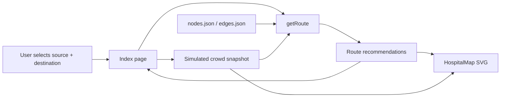

# WayCare (Pathfinder Pro)

A browser-based indoor navigation app for hospital wayfinding. A user picks a source and destination inside the hospital and gets route recommendations optimized for speed, low crowding, wheelchair access, or emergency movement — complete with turn-by-turn instructions and a live SVG floor map.

Live demo: [link] <!-- add link -->

---

## How it works

The hospital is modeled as a weighted graph: **25 locations across 3 floors** (clinical rooms, corridors, lifts, stairs), connected by **38 edges**. A weighted A* search finds optimal paths through that graph, with edge weights adjusted per routing mode and in response to a live (simulated) crowd model.



- **Routing engine:** weighted A* using a Euclidean-distance heuristic scaled by minimum cost-per-meter, so the search stays admissible while still favoring efficient paths.
- **Routing modes:** fastest, shortest, least-crowded, wheelchair-accessible, and emergency — each applies different edge-cost rules. Wheelchair mode removes inaccessible (e.g. stairs-only) edges from the graph entirely rather than just penalizing them; emergency mode re-weights routes when simulated crowd density crosses a threshold.
- **Crowd simulation:** a deterministic, in-memory model updates every 5 seconds and feeds into route cost calculations in real time — there's no live sensor feed, this is simulated data standing in for one.

**Note on the folder name:** the routing logic lives under `src/backend/`, but this is entirely a naming convention — the app has no server. The "backend" module is a plain TypeScript module imported directly into the frontend and bundled with the rest of the browser app. Everything runs client-side.

---

## Tech stack

- **Framework:** React 18, Vite 5 (SWC plugin)
- **Language:** TypeScript
- **Routing (app):** React Router DOM 6
- **Styling:** Tailwind CSS 3, Radix UI / shadcn-style primitives
- **Testing:** Vitest, Testing Library, JSDOM
- **Linting:** ESLint + typescript-eslint

No backend framework, database, authentication, or external API is used — the entire app, including the "route engine," runs in the browser.

---

## Project structure

```
src/
├── backend/
│   ├── data/nodes.json         # Location/geometry model (25 nodes)
│   ├── data/edges.json         # Navigation connections (38 edges)
│   └── routes/navigation.ts    # Weighted A* engine, mode logic, instruction generation
├── components/
│   ├── HospitalMap.tsx         # SVG floor-map renderer
│   └── ui/                     # shadcn-style UI primitives
├── pages/
│   ├── Index.tsx               # Main feature page — search, crowd sim, recommendations
│   └── NotFound.tsx            # 404 page
├── hooks/                      # Toast + viewport hooks
├── lib/utils.ts                # Class-name merge utility
├── App.tsx                     # Providers + route table
└── main.tsx                    # React DOM entry point
```

---

## Core routing function

```ts
getRoute(request: {
  source: string;
  destination: string;
  mode: 'fastest' | 'shortest' | 'least-crowded' | 'wheelchair' | 'emergency';
  crowdOverrides?: CrowdSnapshot;
}) => {
  path: string[];
  steps: Instruction[];
  instructions: string[];
  time: number;
  distance: number;
  profile: string;
}
```

If no path exists for a given mode, the function returns an empty, valid `RouteResponse` rather than throwing — the UI then displays that route option as unavailable.

---

## Getting started

### Install

```bash
npm install
```

### Run locally

```bash
npm run dev
```

Dev server runs on port `8080`.

### Other commands

| Command | Purpose |
|---|---|
| `npm run build` | Production static build |
| `npm run build:dev` | Build in development mode |
| `npm run preview` | Serve the built output locally |
| `npm run lint` | Run ESLint |
| `npm run test` | Run the Vitest suite once |
| `npm run test:watch` | Run tests in watch mode |

No environment variables are required — the app has no external services to configure.

### Testing

Unit tests (Vitest + Testing Library) cover route correctness across sample paths, turn-by-turn instruction generation, and mode-specific behavior (e.g. wheelchair-mode edge exclusion, emergency re-weighting).

---

## Deployment

This is a static frontend build — deploy the `dist/` output from `npm run build` to any static host (Vercel, Netlify, GitHub Pages, etc.). No server process, database, or environment configuration is needed.

---

## Known limitations

Documenting these explicitly rather than letting them surface as surprises:

- **No real backend.** The graph is bundled static JSON, not served from a database or API.
- **Crowd data is simulated,** not sourced from real sensors.
- **No authentication, accounts, or persistence** — all state is ephemeral browser memory, cleared on refresh.
- **Node/edge IDs from direct `getRoute` calls aren't validated** — the UI only ever supplies known graph IDs via its Select controls, so this hasn't been an issue in practice, but it's not defensively guarded at the function level.

These were deliberate scope choices for a project focused on the pathfinding and routing-mode logic itself, not a full-stack deployment.

## License

MIT
